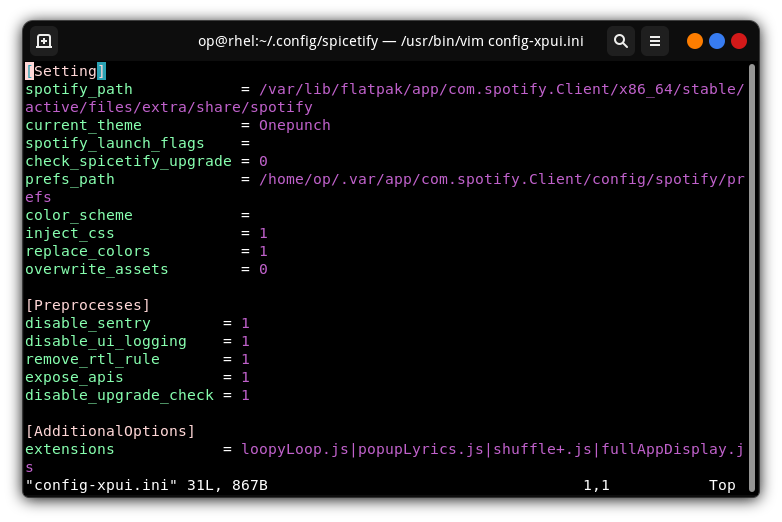
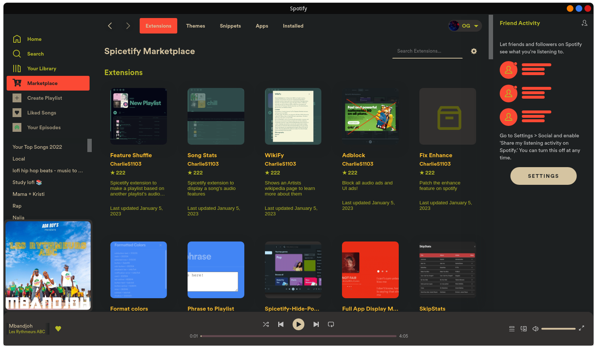
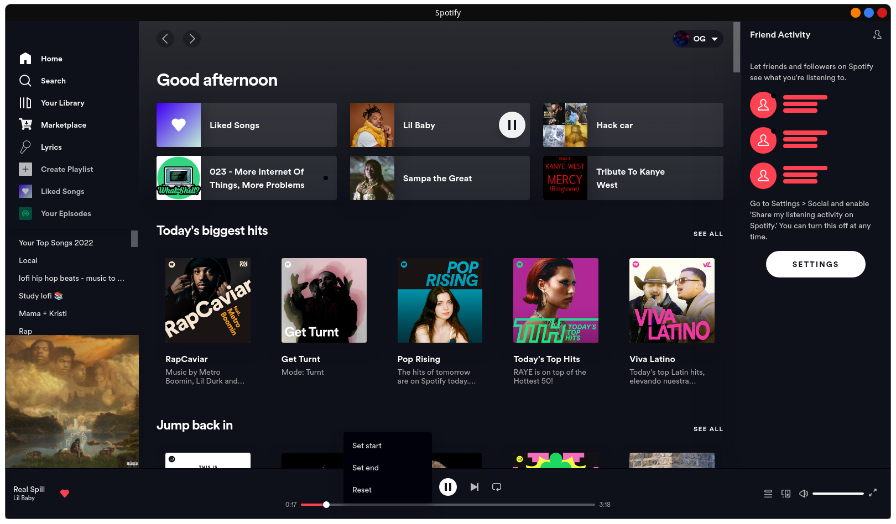
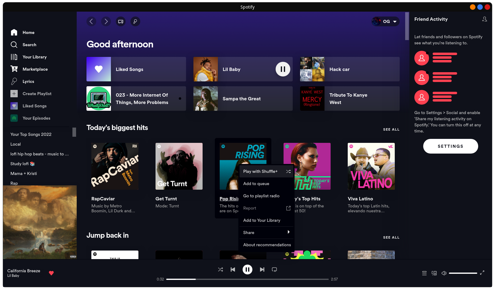

# Spotify Customization Hack With Spicetify & SpotX


## Install Spotify client with flatpak

```
[op@rhel ~]$ cd ~flatpak install flathub com.spotify.Client
```

## Install Spotx (No suport for Snap)
``` 
[op@rhel CustomApps]$ bash <(curl -sSL https://raw.githubusercontent.com/SpotX-CLI/SpotX-Linux/main/install.sh) -ce -E leftsidebar

```

Spotify should now work with no ads whatsoever. Note that ads can also be removed with Spicetify Extensions


## Install Spicetify 

```
[op@rhel ~]$ curl -fsSL https://raw.githubusercontent.com/spicetify/spicetify-cli/master/install.sh | sh
```

Add permissions to spotify installation folders

```
[op@rhel ~] sudo chmod a+wr /home/op/.var/app/com.spotify.Client
[op@rhel ~] sudo chmod a+wr /var/lib/flatpak/app/com.spotify.Client/x86_64/stable/active/files/extra/share/spotify

```

Add these paths to spicetify's config file (`config-xpui.ini `)

```
[op@rhel ~]sudo vi config-xpui.ini

```
Edit 

``` 
spotify_path            = /var/lib/flatpak/app/com.spotify.Client/x86_64/stable/active/files/extra/share/spotify
and
prefs_path              = /home/op/.var/app/com.spotify.Client/config/spotify/prefs
```

Save and do 

```
[op@rhel ~] spicetify apply
```

<p align="center">  </p>


## Install Spicetify Themes and Extensions

You can install it with 

```
curl -fsSL https://raw.githubusercontent.com/spicetify/spicetify-marketplace/main/resources/install.sh | sh
```
or manually download the latest release here https://github.com/spicetify/spicetify-marketplace/releases and unzip into `~/.config/spicetify/CustomApps/`

```
[op@rhel ~] wget https://github.com/spicetify/spicetify-marketplace/releases/download/v0.8.4/spicetify-marketplace.zip && cd unzip spicetify-marketplace ~/.config/spicetify/CustomApps/
```

## Applying Theme 
```
[op@rhel ~]$ cd /home/op/.config/spicetify/Themes
[op@rhel ~]$ spicetify spicetify config current_theme tHeMe_nAmE 
```
## Applying theme with Marketplace
Make sure there is a `marketplace` folder in `/home/op/.config/spicetify/CustomApps`
```
[op@rhel ~]$ spicetify config custom_apps marketplace
[op@rhel ~]$ spicetify apply
```

Open Spotify , on the left side should now appears an app called `Marketplace`

Browse it and install whatever gets your interest.

<p align="center">  </p>


## Appling Extensions and Custom apps
At this point you should have apps in `/home/op/.config/spicetify/CustomApps` . If not, get some frome here
``` 
[op@rhel ~]$ wget https://github.com/spicetify/spicetify-cli/tree/master/CustomApps 
and copy them into /home/op/.config/spicetify/CustomApps
```

Same goes for Extensions 
```
[op@rhel ~]$ wget https://github.com/spicetify/spicetify-cli/tree/master/Extensions
```

Apply Apps or Extensions with
```
[op@rhel ~]$ spicetify config extensions <file name.js>   ##Normaly, it should be just the filename. It didnt work in my case and I had to add the actual extension (.js) for it to work
[op@rhel ~]$ spicetify apply
```

Apply Apps with
```
[op@rhel ~]$ spicetify config custom_apps File_NaMe
[op@rhel ~]$ spicetify apply 
```

My Best Apps & Extensions
#### lyrics-plus fullAppDisplay.js popupLyrics.js shuffle+.jsbookmark.js loopyLoop.js      

<p align="center">  </p>

<p align="center">  </p>

<p align="center">  </p>
